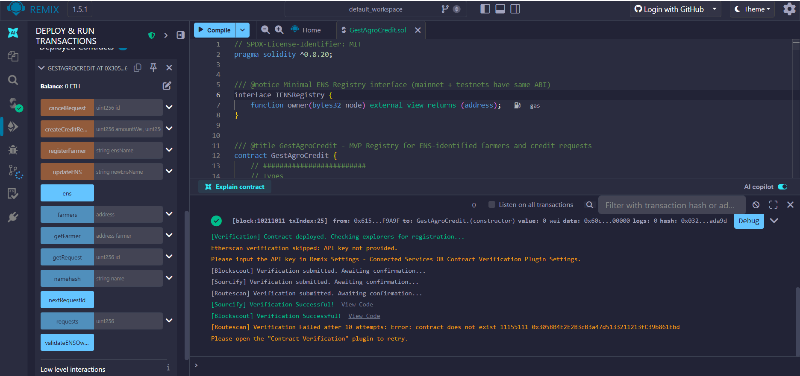
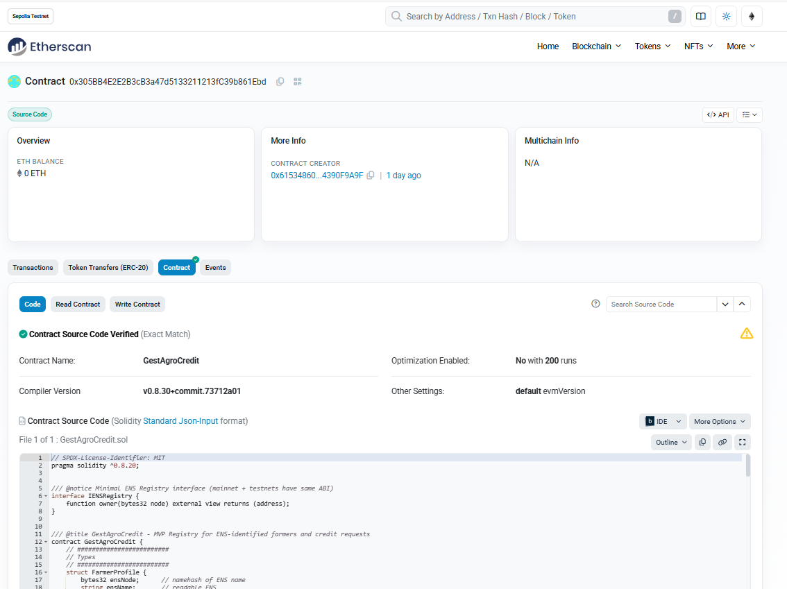
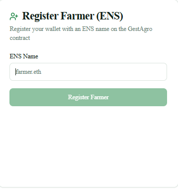
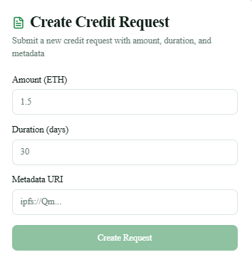
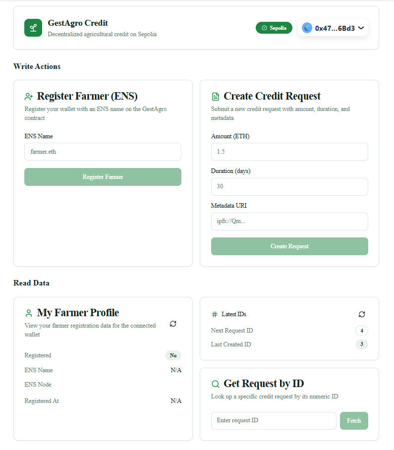
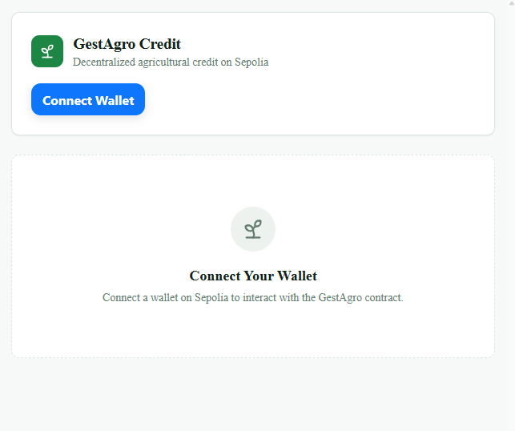

# 🌱 GestAgro Credit

**GestAgro Credit** is a DeFi MVP designed to improve access to credit for small and medium farmers using **blockchain** and **decentralized identity (ENS)**.

This project was developed as part of the **HackMoney 2026 Hackathon**, with a strong focus on **simplicity, transparency, and real-world impact**.

---

## Problem

Small and medium farmers often face major barriers when trying to access credit:

- Lack of formal credit history
- Bureaucratic and centralized processes
- No digital identity or on-chain reputation
- Exclusion from traditional financial systems

---

## Solution

GestAgro Credit proposes a **decentralized credit registry**, where:

- Farmers are identified using **ENS names** instead of anonymous wallet addresses
- Credit requests are registered **on-chain**
- Identity and transparency are prioritized from day one

This MVP focuses on **identity + credit demand**, intentionally leaving funding and repayment logic for future iterations.

---

## Architecture (MVP)

- **Blockchain**: Ethereum (Sepolia testnet)
- **Smart Contracts**: Solidity
- **Identity**: ENS (Ethereum Name Service)
- **Frontend**: Next.js dApp (wallet connection + ENS-based flows)
- **Deployment**: Vercel

---

## Smart Contract

The core business logic lives in the smart contract:

- `contracts/GestAgroCredit.sol`

 Full technical documentation is available here:  
 [`README.contracts.md`](./README.contracts.md)

---

## Tech Stack

- **Solidity ^0.8.x**
- **Ethereum (Sepolia)**
- **ENS (Ethereum Name Service)**
- **Next.js + React + TypeScript**
- **ethers.js / wagmi**
- **Vercel**
- **Remix IDE** (development & testing)

---

## ENS Integration (Key Feature)

This project integrates ENS according to the official ENS documentation:

- Uses the **ENS Registry** contract
- Uses **ENS namehash** to generate node identifiers
- Optionally validates ENS ownership using `ens.owner(node)`
- ENS is used as a **decentralized identity layer**, not as a resolver

---

## Current Status

- ✅ Smart contract implemented
- ✅ ENS-based farmer registration
- ✅ Credit request creation
- ✅ Frontend dApp implemented
- ✅ Deployed on testnet (Sepolia)

---

##  Demo Video

 Watch the demo here:  
https://youtu.be/D3XX9LJiY8c

---

## Project Screenshots

### Smart Contract (Remix)

### Contract Verified on Etherscan

### Register Farmer with ENS

### Create Credit Request

### Dashboard (Connected Wallet)

### Connect Wallet

---

## Pitch Deck

Project presentation (slides):  
👉 https://docs.google.com/presentation/d/1KEwOW3cJ42AmBOEVbKcsYoVwjeBbgRrb/present

---

## Roadmap (Post-Hackathon)

- Funding and repayment logic
- Stablecoin integration
- Farmer reputation scoring
- DAO-based credit evaluation
- Integration with real-world agricultural data

---

## 🤝 Contributing

This project is evolving. Contributions, ideas, and feedback are welcome.

---

## Author

**Hilaria Eduarda Jesus**  
Blockchain & Web3 Developer
